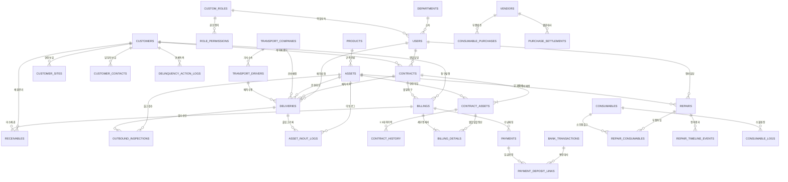
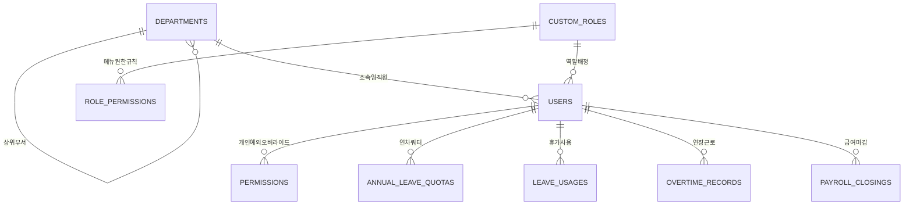
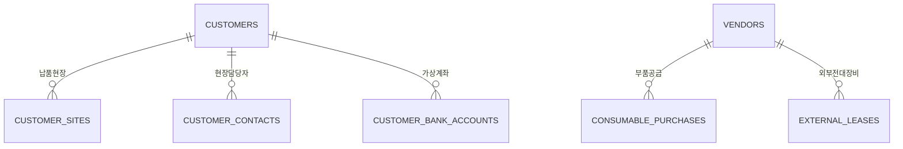
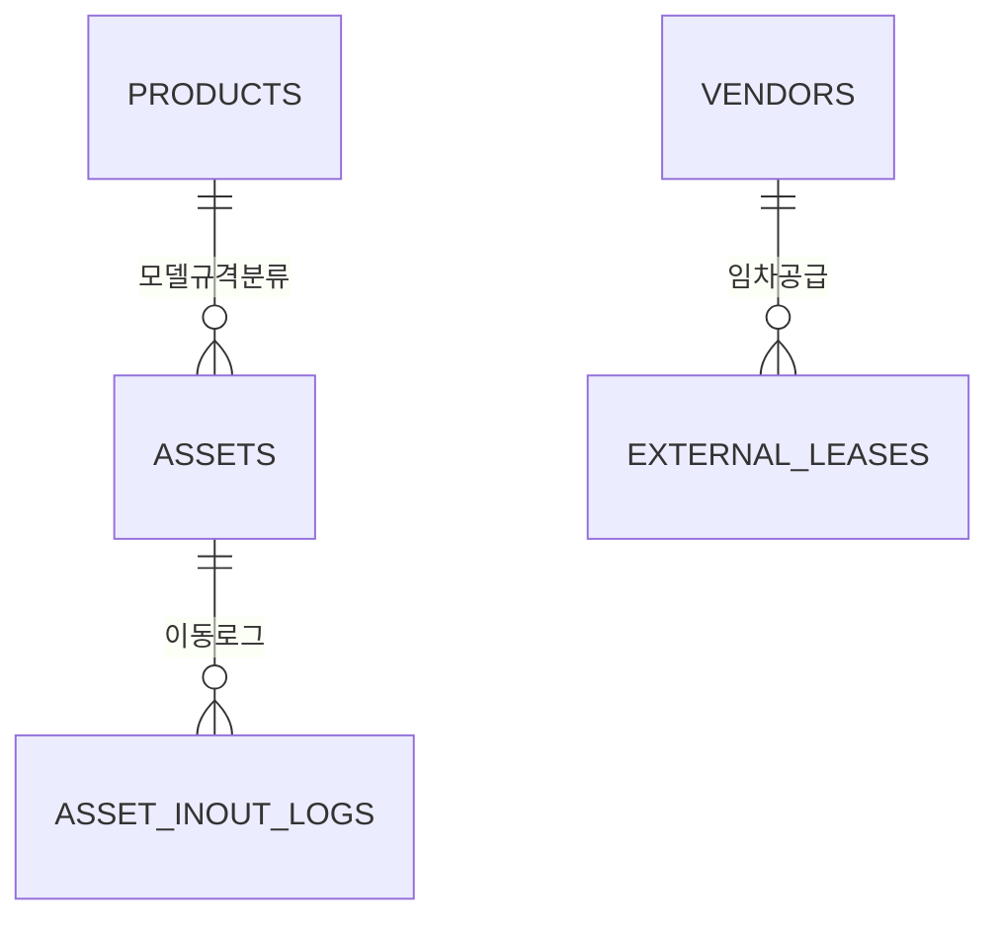
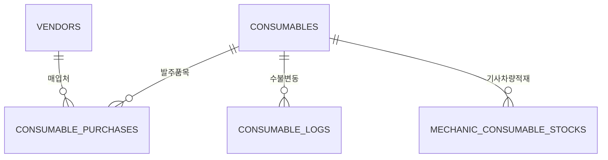
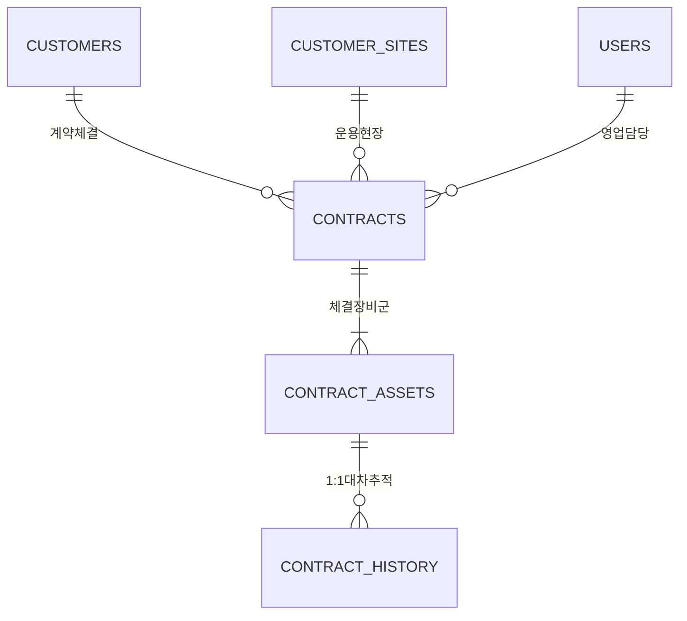
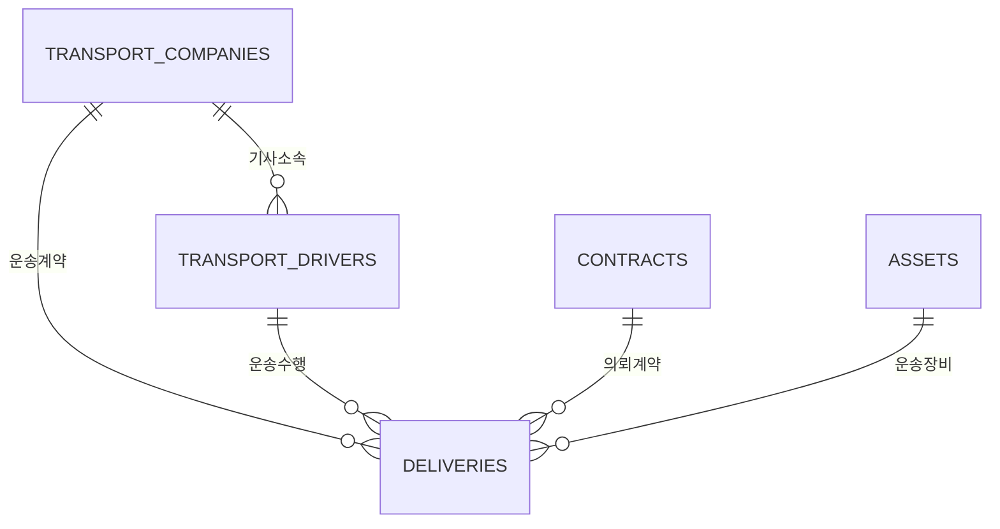
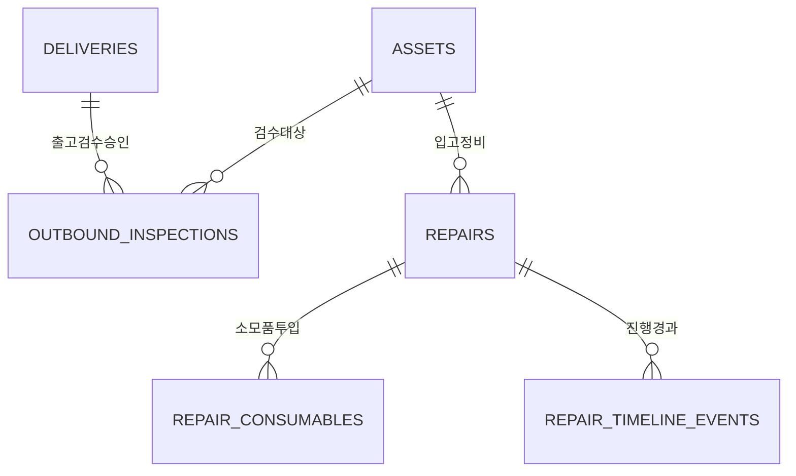
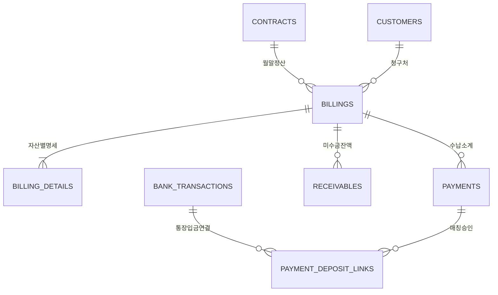

# [기연리프트 ERP] 데이터베이스 ERD 및 스키마 명세서 (Database ERD & Schema Specification)

---

## 1. 개요 및 설계 표준 원칙

본 문서는 기연리프트 ERP 시스템의 단일 진실의 원천(SSOT) 데이터베이스 구조를 공식 정의하는 ERD(Entity-Relationship Diagram) 명세서이다.  
본 명세서는 [`schema.sql`](file:///d:/01.AntiGravity/Giyuen_Lift/schema.sql) 및 [`src/services/db.ts`](file:///d:/01.AntiGravity/Giyuen_Lift/src/services/db.ts)를 원본 기준으로 삼으며, **전사 시스템 개발 표준 헌장(카테고리 I~VI)**을 예외 없이 충족하도록 체계화되었다.

### 1.1 렌탈 도메인 3대 핵심 가치 반영
1. **렌탈 자산의 효과적인 운용**: 자산(`assets`)의 라이프사이클(`IDLE` ➔ `OUTBOUND_WAITING` ➔ `RENTED` ➔ `INSPECTION` ➔ `REPAIRING` ➔ `AVAILABLE`)이 계약(`contracts`), 배차(`deliveries`), 검수(`outbound_inspections`), 정비(`repairs`) 체인과 1:1 결합되어 현장 물리적 제약과 100% 일치한다.
2. **발생 사건(Event) 기록의 무누락 DB 저장**: 대차 교체(`contract_history`), 입출고 이동(`asset_inout_logs`), 정비 타임라인(`repair_timeline_events`), 개인정보 접근(`privacy_access_logs`) 등 전사 모든 비즈니스 이벤트는 이력 테이블에 영구 보존된다.
3. **임직원 업무의 최소 조작 & 최대 편익**: 외래키(FK) 제약조건과 자동 상속 규칙을 통해 중복 입력을 배제하고 단일 트랜잭션 완결성을 보장한다.

### 1.2 컬럼 6단계 논리적 배치 표준 (Column Layout Standard)
모든 테이블은 일관된 인지 흐름을 위해 아래 6단계 순서로 컬럼이 배치된다:
1. **① 식별자/PK**: `id`
2. **② 핵심 본질 속성**: 명칭, 코드, 유형, 제원 등
3. **③ 관계/외래키(FK)**: 부모 테이블 참조 ID (`REFERENCES ... ON DELETE ...`)
4. **④ 일정/수량/금액**: 일자, 기간, 단가, 수량, 금액, 잔액
5. **⑤ 상태/메모/비고**: 진행 상태 코드, 비고, 첨부파일 URL
6. **⑥ 감사 추적(Audit)**: `createdAt`, `updatedAt`, `tenant_id`

---

## 2. 전사 핵심 라이프사이클 통합 ERD (Core Domain ERD)

---

## 3. 도메인별 세부 엔티티 및 스키마 명세

### 도메인 1: 조직, 계정 및 인사노무 (Org, Users & HR)

#### 1.1 `departments` (부서 마스터)
조직도 계층 트리 구조를 표현하는 기본 부서 엔티티.
- **PK**: `id` (TEXT, 예: `DEPT-0000001`)
- **주요 컬럼**:
  - `name` (TEXT, NOT NULL, UNIQUE): 부서명 (기연리프트, 관리부, 영업부, 출고팀, AS팀, 외국인 등)
  - `parentDepartmentId` (TEXT, FK): 상위 부서 `departments.id` (트리 재귀 참조)
  - `managerId` (TEXT, FK): 부서장 `users.id`
  - `createdAt`, `updatedAt` (TEXT, NOT NULL)
  - `tenant_id` (TEXT, NOT NULL, DEFAULT 'giyeun')

#### 1.2 `users` (사용자 및 임직원 마스터)
전사 로그인 계정 및 직원 인사 정보 엔티티.
- **PK**: `id` (TEXT, 예: `USR-0000001`, `u-1`)
- **주요 컬럼**:
  - `loginId` (TEXT, NOT NULL, UNIQUE): 사번/로그인 ID
  - `passwordHash` (TEXT, NOT NULL): 암호화 해시
  - `name` (TEXT, NOT NULL): 성명
  - `departmentId` (TEXT, FK): 소속 부서 `departments.id`
  - `position` (TEXT): 직급 (사장, 부사장, 상무, 부장, 차장, 과장, 대리, 주임, 사원)
  - `managerId` (TEXT, FK): 직속 상급자 `users.id`
  - `role` (TEXT, NOT NULL): 시스템 등급 (`ADMIN`, `MANAGER`, `USER`, `MECHANIC`)
  - `status` (TEXT, NOT NULL): 재직 상태 (`ACTIVE`, `LEAVE_OF_ABSENCE`, `RETIRED`)
  - `baseSalary` (DOUBLE PRECISION): 기본급 (급여 정산 권한자 전용)
  - `birthDate` (TEXT): 생년월일 (개인정보보호법 제24조의2 준수, 주민등록번호 대체)
  - `joinDate`, `retireDate` (TEXT): 입사일 / 퇴사일
  - `customRoleId` (TEXT, FK): 상속 권한 명칭 `custom_roles.id`
  - `createdAt`, `updatedAt`, `tenant_id`

#### 1.3 `custom_roles` & `role_permissions` (권한 명칭 마스터 및 메뉴 규칙)
직무 기반 롤(Role) 및 메뉴별 읽기/쓰기 권한 제어 엔진.
- **`custom_roles` PK**: `id` (TEXT, 예: `role_mgmt`, `role_sales`, `role_logistics`, `role_mechanic`)
  - `name` (TEXT, NOT NULL): 권한 명칭
  - `description` (TEXT): 권한 설명
  - `isSystem` (BOOLEAN): 시스템 기본 내장 여부
- **`role_permissions` PK**: `id` (TEXT, 예: `roleperm-role_sales-contract`)
  - `roleId` (TEXT, FK): `custom_roles.id` (ON DELETE CASCADE)
  - `menuId` (TEXT, NOT NULL): 단일 표준 단수형 메뉴 ID
  - `canView` (BOOLEAN, DEFAULT false): 메뉴 조회 권한
  - `canSave` (BOOLEAN, DEFAULT false): 메뉴 저장/수정 권한
  - 제약조건: `UNIQUE("roleId", "menuId")`

#### 1.4 `permissions` (개인별 메뉴 접근 권한 - 레거시/글로벌 동기화)
- **PK**: `id` (TEXT, 예: `perm-USR-0000004-contract`)
- **FK**: `userId` ➔ `users.id` (ON DELETE CASCADE)
- **특징**: `role_permissions` 및 `assignUserRole`과 1:1 양방향 실시간 동기화 유지 (805개 행 무손실 보존).

#### 1.5 인사노무 테이블군 (`annual_leave_quotas`, `leave_usages`, `overtime_records`, `payroll_closings`)
- **연차 쿼터 (`annual_leave_quotas`)**: `userId`, `year`, `baseDays`, `usedDays`, `remainingDays`
- **휴가 사용 (`leave_usages`)**: `userId`, `leaveType` (`ANNUAL`, `HALF_AM`, `HALF_PM`, `SPECIAL`, `SICK` 등), `startDate`, `endDate`, `usedDays`
- **연장 근로 (`overtime_records`)**: `userId`, `workDate`, `workType`, `startTime`, `endTime`, `overtimeHours`
- **급여 마감 (`payroll_closings`)**: `closingYm`, `userId`, `baseSalary`, `overtimePay`, 4대보험 공제(`nationalPension`, `healthInsurance`, `longTermCare`, `employmentInsurance`), 소득세(`incomeTax`, `residenceTax`), 실지급액(`netPay`)

---

### 도메인 2: 고객, 매입처 및 거래처 현장 (Customers, Vendors & Sites)

#### 2.1 `customers` (고객사 마스터)
장비를 임차하는 건설사 및 설비업체 매출처 엔티티.
- **PK**: `id` (TEXT, 예: `CUST-0000001`)
- **주요 컬럼**:
  - `name` (TEXT, NOT NULL): 고객사 공식 상호명
  - `bizRegNo` (TEXT): 사업자등록번호 (10자리)
  - `representative` (TEXT): 대표자 성명
  - `bizType`, `bizItem` (TEXT): 업태 / 종목 (사업자등록증 OCR 동기화)
  - `address`, `email`, `billingEmail`, `phone`, `fax` (TEXT)
  - `creditLimit` (DOUBLE PRECISION): 여신 한도액
  - `paymentTerms` (TEXT): 결제 조건 (익월말 현금, 청구일 30일 등)
  - `isBlacklisted`, `blacklistReason` (BOOLEAN, TEXT): 부실/연체 블랙리스트 관리

#### 2.2 `customer_sites` (현장 마스터)
개별 계약 및 장비가 실제로 투입되어 운용되는 물리적 현장 엔티티.
- **PK**: `id` (TEXT, 예: `SITE-0000001`)
- **FK**: `customerId` ➔ `customers.id` (ON DELETE CASCADE)
- **주요 컬럼**:
  - `name` (TEXT, NOT NULL): 현장명 (예: "평택 고덕 삼성전자 P4 복합동")
  - `address` (TEXT NOT NULL): 현장 도로명 주소 (배차 운송비 산정 기준)
  - `contactPerson`, `contactPhone` (TEXT): 현장 소장/담당자 연락처
  - `defaultCheckedSpecs` (TEXT): 현장 요구 안전옵션 세트 (스카이메이트, 협착방지봉, 과상승방지 등)

#### 2.3 `vendors` (매입처/협력사 마스터)
부품 공급사, 외주 정비공장 및 외부 장비 임차처 엔티티.
- **PK**: `id` (TEXT, 예: `VND-0000001`)
- **주요 컬럼**:
  - `name` (TEXT NOT NULL): 협력사명
  - `bizRegNo` (TEXT): 사업자등록번호
  - `representative`, `contactName`, `contact`, `email`, `address`
  - `bankName`, `accountNumber`, `accountHolder` (TEXT): 대금 지급용 계좌정보
  - `bizType`, `bizItem`, `taxTypeCd` (TEXT): 국세청 홈택스 휴폐업 조회 및 업태

---

### 도메인 3: 제품 규격, 개별 자산 및 외부 임차 (Products, Assets & Leases)

#### 3.1 `products` (장비 규격/모델 마스터)
고소작업대의 물리적 제원 및 표준 요금표 엔티티.
- **PK**: `id` (TEXT, 예: `PROD-0000001`)
- **주요 컬럼**:
  - `modelName` (TEXT, NOT NULL, UNIQUE): 규격 모델명 (예: `SJIII-3219`, `SJIII-4632`, `GS-1930`)
  - `manufacturer` (TEXT NOT NULL): 제조사 (SKYJACK, GENIE, DINGLI 등)
  - `category` (TEXT NOT NULL): 장비 구분 (`SCISSOR_ELECTRIC`, `SCISSOR_ENGINE`, `BOOM_ARTICULATED`, `BOOM_TELESCOPIC`)
  - `workingHeightM`, `platformHeightM` (DOUBLE PRECISION): 작업높이 / 발판높이 (미터 m)
  - `loadCapacityKg`, `machineWeightKg` (DOUBLE PRECISION): 적재용량 / 장비 자체중량 (kg)
  - `standardMonthlyRate`, `standardDailyRate` (DOUBLE PRECISION): 표준 월임대료 / 일임대료

#### 3.2 `assets` (개별 실물 렌탈 자산 마스터)
실제 당사 주기장 및 현장에 존재하는 개별 고유 장비 엔티티.
- **PK**: `id` (TEXT, 예: `ASSET-0000001`)
- **주요 컬럼**:
  - `assetNo` (TEXT, NOT NULL, UNIQUE): 자산 고유 번호 (차대 라벨 및 관리번호, 예: `KY-1024`)
  - `productId` (TEXT, FK): 모델 규격 `products.id`
  - `modelName` (TEXT NOT NULL): 비정규화 역참조 모델명 (고속 조회용)
  - `serialNo` (TEXT): 제조사 고유 시리얼 차대번호
  - `manufacturingYear` (INTEGER): 제작 연도
  - `acquisitionCost` (DOUBLE PRECISION): 취득 원가 (감가상각 계산 기초)
  - `status` (TEXT NOT NULL): **자산 상태 라이프사이클** (`RENTED` [대여중], `AVAILABLE` [임대가능], `OUTBOUND_WAITING` [출고대기], `INSPECTION` [입고검수], `REPAIRING` [정비중], `DISPOSED` [매각/폐기])
  - `currentCustomerId` (TEXT, FK): 현재 점유 고객사 `customers.id`
  - `currentSiteId` (TEXT, FK): 현재 투입 현장 `customer_sites.id`
  - `assignedContractId` (TEXT, FK): 현재 바인딩된 계약 `contracts.id`
  - `batterySpec`, `tireType`, `hourMeter` (TEXT, DOUBLE PRECISION): 배터리 사양, 논마킹 타이어 여부, 누적 가동시간
  - `nextInspectionDate` (TEXT): 법정 안전검사 유효만료일

#### 3.3 `external_leases` (외부 임차/전대 장비)
자사 자산 부족 시 타 렌탈사로부터 빌려 고객사에 재임대(전대)하는 외부 장비.
- **PK**: `id` (TEXT, 예: `EXTL-0000001`)
- **FK**: `vendorId` ➔ `vendors.id`
- **주요 컬럼**: `vendorName`, `modelName`, `serialNo`, `monthlyRate`, `dailyRate`, `rentalStartDate`, `rentalEndDate`, `status`

---

### 도메인 4: 소모품, 부품 재고 및 수불 (Consumables & Parts)

#### 4.1 `consumables` (소모품/부품 품목 마스터)
고소작업대 정비 및 수리에 소요되는 배터리, 컨트롤러, 유압유, 릴레이, 모터 등 부품 엔티티.
- **PK**: `id` (TEXT, 예: `CSM-0000001`)
- **주요 컬럼**:
  - `name` (TEXT NOT NULL): 부품명
  - `modelName`, `spec` (TEXT): 적용 모델 / 규격
  - `unit` (TEXT NOT NULL DEFAULT 'EA'): 단위 (EA, SET, CAN, M)
  - `currentStock`, `safetyStock` (INTEGER NOT NULL): 현재 본사 창고 재고 / 안전 재고
  - `standardCost` (DOUBLE PRECISION): 표준 매입 단가
  - `location` (TEXT): 창고 랙/선반 보관 위치

#### 4.2 `consumable_purchases` & `consumable_logs` (부품 발주 및 수불 원장)
- **`consumable_purchases`**: `purchaseNo`, `consumableId`, `vendorId`, `orderQty`, `unitPrice`, `totalAmount`, `status` (`ORDERED`, `RECEIVED`, `CANCELLED`)
- **`consumable_logs`**: `consumableId`, `logType` (`IN_PURCHASE`, `OUT_REPAIR`, `ADJUSTMENT`), `qty`, `unitPrice`, `balanceAfter`, `relatedEntityId` (`repairs.id` 등)

---

### 도메인 5: 계약 체결, 장비 매핑 및 라이프사이클 (Contracts & Assets)

#### 5.1 `contracts` (임대차 계약 마스터)
고객사와 체결한 고소작업대 임대차 기본 계약 엔티티.
- **PK**: `id` (TEXT, 예: `CONTR-0000001`)
- **주요 컬럼**:
  - `contractNo` (TEXT, NOT NULL, UNIQUE): 계약서 고유 번호
  - `customerId` (TEXT, FK): 계약 고객사 `customers.id` (ON DELETE RESTRICT)
  - `siteId` (TEXT, FK): 납품 현장 `customer_sites.id`
  - `salespersonId` (TEXT, FK): 담당 영업사원 `users.id`
  - `contractDate` (TEXT NOT NULL): 계약 체결일
  - `contractStartDate`, `contractEndDate` (TEXT NOT NULL): 계약 시작일 / 종료일
  - `billingCycleDay` (INTEGER NOT NULL DEFAULT 31): 청구 마감 주기 (말일 또는 특정일)
  - `monthlyRateTotal` (DOUBLE PRECISION NOT NULL): 계약 장비 월임대료 합산 총액
  - `deliveryFeePayer`, `returnFeePayer` (TEXT NOT NULL DEFAULT 'CUSTOMER'): 운송비 부담 주체 (`CUSTOMER`, `OURS`, `VENDOR`)
  - `status` (TEXT NOT NULL): 계약 상태 (`ACTIVE`, `EXTENDED`, `TERMINATED`, `CANCELLED`)

#### 5.2 `contract_assets` (계약 체결 자산 상세 매핑)
단일 계약 내에 묶여 실제 현장에 투입된 개별 장비 및 일할/월할 단가 엔티티.
- **PK**: `id` (TEXT, 예: `CAST-0000001`)
- **FK**: `contractId` ➔ `contracts.id` (ON DELETE CASCADE)
- **FK**: `assetId` ➔ `assets.id` (ON DELETE RESTRICT)
- **주요 컬럼**:
  - `productId` (TEXT, FK): 장비 규격 모델 ID
  - `monthlyRate`, `dailyRate` (DOUBLE PRECISION NOT NULL): 해당 자산의 월임대료 / 일할 단가
  - `contractStartDate`, `contractEndDate` (TEXT NOT NULL): 자산별 현장 가동 기간
  - `status` (TEXT NOT NULL): 자산 계약 상태 (`ACTIVE` [가동중], `EXCHANGED` [대차회수], `RETURNED` [정상반납])
  - `isReplaced` (BOOLEAN DEFAULT false): 대차 교체로 회수되었는지 여부
  - `replacementAssetId` (TEXT, FK): 교체 투입된 후장비 `assets.id`

#### 5.3 `contract_history` (계약 변동 및 대차/교체 1:1 감사 이력)
**전사 표준 헌장 4.2 대차 교체 이력 전자산 ➔ 후장비 1:1 완벽 추적성(Audit Trail)**을 보존하는 엔티티.
- **PK**: `id` (TEXT, 예: `CHST-0000001`)
- **FK**: `contractId` ➔ `contracts.id`
- **주요 컬럼**:
  - `changeType` (TEXT NOT NULL): 변경 유형 (`EXCHANGE` [대차교체], `EXTEND` [연장], `RETURN` [반납], `RATE_CHANGE` [단가변경])
  - `beforeAssetId` (TEXT, FK): 회수된 전자산 `assets.id`
  - `afterAssetId` (TEXT, FK): 새로 투입된 후장비(대차) `assets.id`
  - `effectiveDate` (TEXT NOT NULL): 교체 발생일 (전자산 전일 마감 ➔ 후장비 당일 승계 기준일)
  - `calculatedProRataAmount` (DOUBLE PRECISION): 교체 시점 전자산 확정 매출 기여액 (헌장 4.1 일할 집계)
  - `reason` (TEXT): 교체 사유 (장비 고장, 규격 상향 요구 등)
  - `processedBy` (TEXT, FK): 처리 담당자 `users.id`

---

### 도메인 6: 배차 및 운송 물류 (Logistics & Transport)

#### 6.1 `transport_companies` & `transport_drivers` (운송 거래처 및 기사 마스터)
- **`transport_companies`**: `id`, `name`, `bizRegNo`, `representative`, `contactPhone`, `email`, `standardFareTable` (표준 운송 요율표)
- **`transport_drivers`**: `id`, `transportCompanyId`, `name`, `phone`, `birthDate` (생년월일 전환 완비), `vehicleNo` (화물차 번호), `vehicleType` (5톤 카고, 11톤 윙바디, 셀프로더 등)

#### 6.2 `deliveries` (배차 의뢰 및 운송 실행 원장)
**전사 표준 헌장 2.3 대차 교체 단일 'EXCHANGE' 배차 1건 발행 원칙**을 수행하는 엔티티.
- **PK**: `id` (TEXT, 예: `DLV-0000001`)
- **FK**: `contractId` ➔ `contracts.id`, `assetId` ➔ `assets.id`, `driverId` ➔ `transport_drivers.id`
- **주요 컬럼**:
  - `deliveryNo` (TEXT NOT NULL UNIQUE): 배차 번호
  - `deliveryType` (TEXT NOT NULL): 배차 구분 (`DISPATCH` [출고], `RETURN` [회수], `EXCHANGE` [교환/대차], `TRANSFER` [공장간이동])
  - `departureLocation`, `destinationLocation` (TEXT NOT NULL): 상차지(출발지) / 하차지(도착지)
  - `scheduledDateTime`, `actualDateTime` (TEXT NOT NULL): 배차 예정 일시 / 실제 운송 완료 일시
  - `fareAmount` (DOUBLE PRECISION NOT NULL): 운송료
  - `paidBy` (TEXT NOT NULL DEFAULT 'CUSTOMER'): 운송비 청구/부담 주체 (`CUSTOMER`, `OURS`, `VENDOR`)
  - `status` (TEXT NOT NULL): 배차 상태 (`REQUESTED`, `ASSIGNED`, `IN_TRANSIT`, `DELIVERED`, `CANCELLED`)
  - `requesterId` (TEXT, FK): 배차 의뢰자 (영업사원)
  - `accepterId` (TEXT, FK): 배차 승인 및 기사 배정자 (출고담당자)

---

### 도메인 7: 출고 검수 및 장비 정비 (Outbound & Repairs)

#### 7.1 `outbound_inspections` (출고 검수 승인 마감 원장)
**전사 표준 헌장 1.3 출고 검수 승인 마감 시 자산 상태 `RENTED` 전환 원칙**을 완결짓는 핵심 엔티티.
- **PK**: `id` (TEXT, 예: `OIN-0000001`)
- **FK**: `deliveryId` ➔ `deliveries.id`, `assetId` ➔ `assets.id`, `inspectorId` ➔ `users.id`
- **주요 컬럼**:
  - `inspectionDate` (TEXT NOT NULL): 검수 일시
  - `checklistPassed` (BOOLEAN NOT NULL DEFAULT true): 법정 필수 안전점검 통과 여부
  - `batteryStatus` (TEXT): 배터리 비중 및 전압 측정값
  - `tireStatus` (TEXT): 타이어 마모 및 크랙 상태
  - `safetyDecalPassed` (BOOLEAN): 안전 수칙 스티커 부착 여부
  - `approvalStatus` (TEXT NOT NULL): 최종 승인 상태 (`APPROVED`, `REJECTED`, `PENDING`)
  - `photoUrls` (JSONB / TEXT): 검수 현장 사진 4방향 증빙

#### 7.2 `repairs` (장비 입고 정비 및 현장 AS 원장)
장비 고장 수리, 입고 정기점검 및 소모품 투입 내역을 관리하는 엔티티.
- **PK**: `id` (TEXT, 예: `REP-0000001`)
- **FK**: `assetId` ➔ `assets.id`, `mechanicId` ➔ `users.id`, `siteId` ➔ `customer_sites.id`
- **주요 컬럼**:
  - `repairNo` (TEXT NOT NULL UNIQUE): 정비/AS 접수 번호
  - `repairType` (TEXT NOT NULL): 구분 (`INBOUND_REGULAR` [입고정기정비], `FIELD_AS` [현장출장AS], `EMERGENCY` [긴급수리], `OUTSOURCED` [외주정비])
  - `symptomDescription` (TEXT NOT NULL): 고장 증상
  - `actionTaken` (TEXT): 조치 결과
  - `repairStatus` (TEXT NOT NULL): 상태 (`RECEIVED`, `DIAGNOSING`, `PARTS_WAITING`, `REPAIRING`, `COMPLETED`)
  - `startDate`, `completionDate` (TEXT): 정비 착수일 / 수리 완료일
  - `repairCostTotal`, `laborCost`, `partsCost` (DOUBLE PRECISION): 정비 총비용, 공임, 부품비

#### 7.3 `repair_consumables` & `repair_timeline_events`
- **`repair_consumables`**: `repairId`, `consumableId`, `usedQty`, `unitPrice`, `totalAmount`
- **`repair_timeline_events`**: `repairId`, `eventStatus`, `eventDescription`, `photoUrls`, `recordedBy`

---

### 도메인 8: 매출 청구, 수납 및 회계 (Billings & Finance)

#### 8.1 `billings` (매출 청구서 마스터)
매월 말일 또는 정산 주기에 계약별 가동 내역을 취합하여 발행하는 청구서 엔티티.
- **PK**: `id` (TEXT, 예: `BILL-26090001`)
- **FK**: `customerId` ➔ `customers.id`, `contractId` ➔ `contracts.id`
- **주요 컬럼**:
  - `billingNo` (TEXT NOT NULL UNIQUE): 청구서 번호
  - `billingYm` (TEXT NOT NULL): 청구 연월 (YYYY-MM)
  - `billingDate`, `dueDate` (TEXT NOT NULL): 청구 발행일 / 입금 마감일
  - `rentAmount` (DOUBLE PRECISION NOT NULL): 장비 렌탈료 합산액
  - `deliveryFeeAmount` (DOUBLE PRECISION NOT NULL DEFAULT 0): 고객 청구 운송비
  - `repairFeeAmount` (DOUBLE PRECISION NOT NULL DEFAULT 0): 고객 과실 파손 수리비
  - `discountAmount` (DOUBLE PRECISION NOT NULL DEFAULT 0): 특약 할인액
  - `vatAmount`, `totalAmount` (DOUBLE PRECISION NOT NULL): 공급가액 부가세(10%) / 청구 총액
  - `collectedAmount` (DOUBLE PRECISION NOT NULL DEFAULT 0): 누적 수납 입금액
  - `balanceAmount` (DOUBLE PRECISION NOT NULL): 청구 잔액 (`totalAmount - collectedAmount`)
  - `status` (TEXT NOT NULL): 청구 상태 (`ISSUED` [발행], `PARTIAL` [부분입금], `PAID` [완납], `OVERDUE` [연체], `CANCELLED`)

#### 8.2 `billing_details` (청구 라인 항목별 세부 명세서)
**전사 표준 헌장 4.1 자산별 매출 기여액 정밀 일할 집계 정책**의 근거가 되는 엔티티.
- **PK**: `id` (TEXT, 예: `BDET-0000001`)
- **FK**: `billingId` ➔ `billings.id` (ON DELETE CASCADE)
- **FK**: `contractAssetId` ➔ `contract_assets.id`, `assetId` ➔ `assets.id`
- **주요 컬럼**:
  - `modelName`, `assetNo` (TEXT): 장비 규격 및 자산번호
  - `periodStart`, `periodEnd` (TEXT NOT NULL): 해당 청구 월 내 실제 가동 시작일 / 종료일
  - `operatingDays` (INTEGER NOT NULL): 실가동 일수
  - `dailyRate`, `monthlyRate` (DOUBLE PRECISION NOT NULL): 적용 일할 단가 / 월 단가
  - `itemAmount`, `vatAmount` (DOUBLE PRECISION NOT NULL): 개별 장비 매출 기여액 / 부가세

#### 8.3 `payments` & `payment_deposit_links` & `bank_transactions` (수납 및 통장 대사)
- **`bank_transactions`**: 통장 스크래핑/엑셀 업로드 원장 (`transactionDate`, `amount`, `bankName`, `depositorOrPayee`, `isMatched`)
- **`payments`**: 수납 확정 원장 (`customerId`, `billingId`, `paymentDate`, `paymentAmount`, `paymentMethod`)
- **`payment_deposit_links`**: 통장 거래와 청구 수납 간의 1:1 대사 연결 (`paymentId`, `bankTransactionId`, `matchedAmount`, `matchedBy`)

#### 8.4 `receivables` (외상매출금 채권 원장)
- **PK**: `id` (TEXT, 예: `RCV-0000001`)
- **FK**: `customerId` ➔ `customers.id`, `billingId` ➔ `billings.id`
- **주요 컬럼**: `baseDate`, `initialReceivable`, `collectedAmount`, `remainingBalance`, `overdueDays`, `agingBucket` (`CURRENT`, `OVERDUE_30`, `OVERDUE_60`, `OVERDUE_90_PLUS`, `BAD_DEBT`)

#### 8.5 `purchase_settlements` & `purchase_settlement_items` (매입처/운송사 월말 지급 대사)
- **전사 표준 헌장 3.5 Gutenberg Z-패턴 및 3.6 유형 B 고밀도 그리드 표준**이 적용된 매입료/운송료 월말 대사 엔티티.
- `vendorId`, `settlementYm`, `totalPayableAmount`, `confirmedAmount`, `rejectedAmount`, `status` (`DRAFT`, `CONFIRMED`, `PAID`)

---

### 도메인 9: 시스템 협업, 차량 및 보안 감사 (Ops, Vehicles & Audit)

#### 9.1 `corporate_vehicles`, `vehicle_operation_logs`, `vehicle_fuel_logs` (법인 차량 운행 및 주유)
- 국세청 업무용승용차 운행기록부 법정 서식 및 주유비 실비 정산 엔진.
- 출발/도착 계기판 주행거리(`driveDistance`), 업무용 사용거리(`businessDistance`), 주유량/주유금액/연비 계산, 계기판 및 영수증 사진 URL 저장.

#### 9.2 `todos` & `work_instructions` (직무 맞춤형 ToDo 피드)
- **전사 표준 헌장 3.3 사용자 맞춤형 직무 중심 ToDo 피드 대시보드 정책**에 따라, 로그인한 임직원의 직무(`targetDept`, `targetRole`, `userId`)에 대응하는 실시간 당면 과제만 카드뉴스로 공급.

#### 9.3 `print_stations` & `print_queue` (분산 네트워크 라벨/출고요청 인쇄 큐)
- 사업장 내 지정 프린터 PC(스테이션)와 클라우드 간의 소켓/폴링 기반 자동 문서 출력 대기열.

#### 9.4 `privacy_access_logs` (법정 개인정보 접속기록 원장)
- 대한민국 개인정보 보호법 제29조(안전조치의무) 및 안전성 확보조치 기준 제8조(접속기록의 보관 및 점검) 법정 의무 준수.
- `userId`, `userName`, `ipAddress`, `actionType` (`LOGIN`, `LOGOUT`, `VIEW`, `CREATE`, `UPDATE`, `DELETE`, `EXCEL_DOWNLOAD`, `UNMASK_VIEW`), `targetMenu`, `targetSubjectName`, `isMasked`, `createdAt`.

---

## 4. 외래키(FK) 무결성 및 CASCADE 삭제 정책 매트릭스

데이터 무결성 훼손 및 고아(Orphan) 레코드 발생을 방지하기 위해 아래 삭제 정책이 DDL 수준에서 엄격히 강제된다:

| 부모 테이블 (Parent) | 자식 테이블 (Child) | 외래키 컬럼 (FK) | 삭제 전파 정책 (ON DELETE) | 비즈니스 사유 |
|:---|:---|:---|:---|:---|
| `departments` | `departments` | `parentDepartmentId` | `SET NULL` | 상위 부서 삭제 시 하위 부서는 최상위로 독립 승격 |
| `departments` | `users` | `departmentId` | `SET NULL` | 부서 폐지 시 소속 직원은 미배정 상태로 보존 |
| `custom_roles` | `role_permissions` | `roleId` | **`CASCADE`** | 권한 명칭 삭제 시 종속된 세부 메뉴 권한 룰 동시 파기 |
| `users` | `permissions` | `userId` | **`CASCADE`** | 임직원 계정 물리 삭제 시 개인 권한 찌꺼기 동시 정리 |
| `customers` | `customer_sites` | `customerId` | **`CASCADE`** | 고객사 삭제 시 산하 현장 정보 일괄 정리 |
| `customers` | `contracts` | `customerId` | **`RESTRICT`** | 계약 체결 이력이 있는 고객사는 임의 물리 삭제 절대 금지 |
| `contracts` | `contract_assets` | `contractId` | **`CASCADE`** | 계약 파기/취소 시 체결 매핑 레코드 동시 삭제 |
| `assets` | `contract_assets` | `assetId` | **`RESTRICT`** | 계약에 묶인 자산은 자산 마스터에서 임의 삭제 불가 |
| `contracts` | `deliveries` | `contractId` | **`SET NULL`** | 계약이 종료되어도 실제 배차/운송 집행 이력은 영구 보존 |
| `deliveries` | `outbound_inspections` | `deliveryId` | **`CASCADE`** | 배차 취소 시 검수 대기 건 동시 무효화 |
| `billings` | `billing_details` | `billingId` | **`CASCADE`** | 청구서 취소 시 세부 명세 라인 일괄 회수 |
| `billings` | `receivables` | `billingId` | **`CASCADE`** | 청구서 취소 시 미수금 대장 채권 라인 동시 취소 |
| `print_stations` | `print_queue` | `stationId` | **`CASCADE`** | 인쇄 스테이션 철거 시 잔류 큐 정리 |

---

## 5. 전사 데이터베이스 무결성 보존 법칙 검증 (Conservation Law)

시스템 내 모든 수치와 상태는 아래 3대 보존 법칙에 의해 수학적으로 1원의 오차도 없이 검증된다:

1. **날짜 보존 법칙 (Date Conservation)**:
   $$\sum \text{가동일수 (operatingDays)} = \text{계약 종료일} - \text{계약 시작일} + 1$$
   - 대차 교체 시: 전자산 가동일 + 후장비 가동일 = 전체 역일수(Calendar Days) 100% 일치.
2. **수지 보존 법칙 (Balance Conservation)**:
   $$\text{청구 총액 (totalAmount)} = \text{수납 확정액 (collectedAmount)} + \text{미수금 잔액 (balanceAmount)}$$
   $$\text{매입 청구액} = \text{지급 확정액} + \text{반려/공제액} \quad (\text{대차 차액 } \mathcal{W}0)$$
3. **자산 라이프사이클 상태 보존 법칙 (Status Conservation)**:
   - 출고 검수 승인 완료(`outbound_inspections.approvalStatus = 'APPROVED'`) 즉시 `assets.status = 'RENTED'` 전환.
   - 반납 입고 검수 완료 즉시 `assets.status = 'AVAILABLE'` 또는 정비 필요 시 `'REPAIRING'` 전환.
